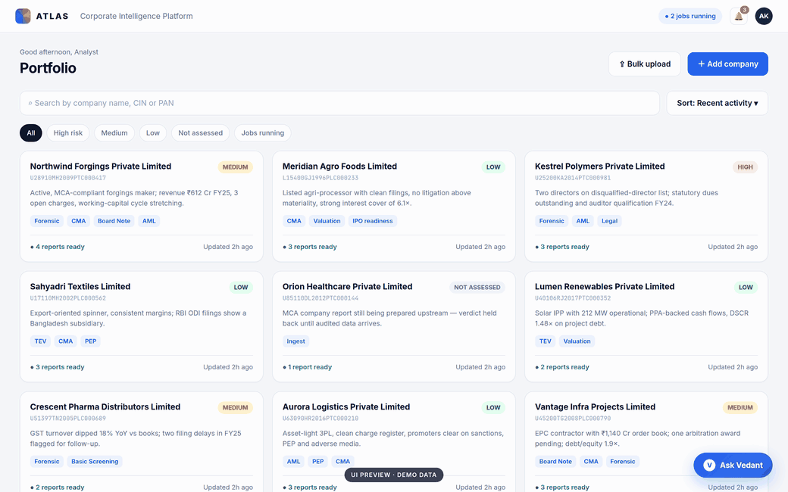
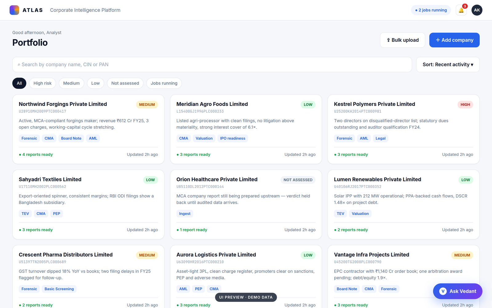
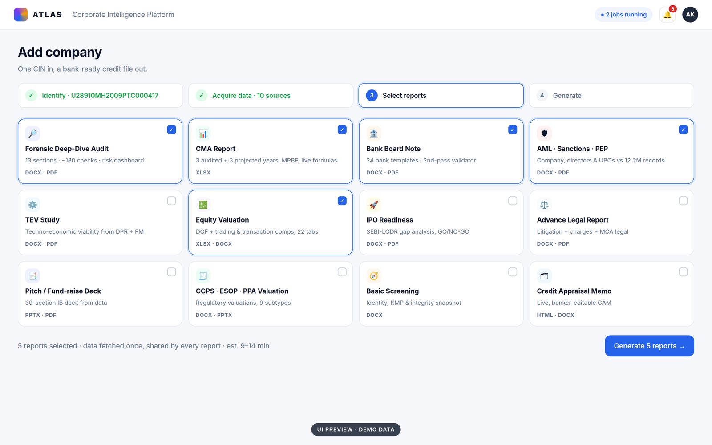
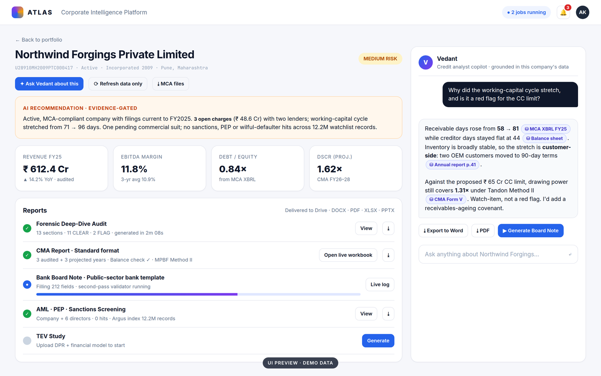
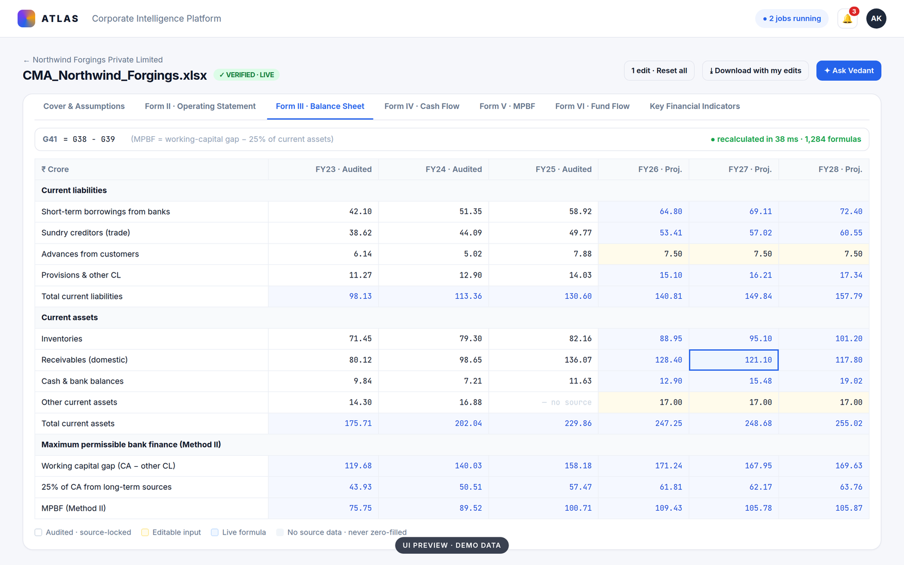

 

**One CIN in. A bank-ready credit file out.**

[Overview](#-what-is-atlas) · [Product tour](#-product-tour) · [What it produces](#-what-it-produces) · [Principles](#-built-on-principles) · [My role](#-my-role)

---

## ◆ What is Atlas?

A credit analyst can spend **weeks** on one corporate credit file. That means pulling company filings, reconciling tax returns, reading court records, screening directors, rebuilding the financials into the bank's format, projecting them forward and writing a long appraisal note in the bank's own template.

**Atlas turns that into minutes.**

Give it a company's **CIN** (Corporate Identity Number). Atlas gathers the company's public, regulatory and financial footprint, and AI agents working under strict verification produce **bank-ready deliverables**: forensic audits, CMA workbooks with live formulas, board notes in the formats of many different banks, techno-economic viability studies, valuations, AML and PEP screening, and pitch decks.

In Greek myth, Atlas carries the heavens. This platform carries the credit desk.

---

## 🏢 In production

Atlas is a **live, commercial SaaS product**, the platform behind **[resurgentindia.ai](https://resurgentindia.ai)**.

- **Used across the company.** Analysts and deal teams run their credit, valuation and due-diligence work on it.
- **Used by clients.** Bankers and client institutions receive Atlas-generated reports, and client teams use the platform directly.
- **Integrated as an API.** Partner systems request reports through a metered, key-based API.
- **Faster, cheaper, more consistent.** Work that took days is produced in minutes, and every figure traces back to its source.

---

## 🎬 Product tour

Portfolio → report picker → company intelligence with the Vedant copilot → live CMA workbook
 
<i>UI previews use fictional demo companies. Client data never leaves the platform.</i>

 

<table>
<tr>
<td width="50%">
<b>Portfolio</b>: every company with an evidence-backed risk verdict
</td>
<td width="50%">
<b>One CIN, many reports</b>: pick the deliverables and Atlas does the rest
</td>
</tr>
<tr>
<td width="50%">
<b>Vedant</b>: an analyst copilot whose every answer cites its source
</td>
<td width="50%">
<b>CMA Live</b>: an editable, formula-driven workbook right in the browser
</td>
</tr>
</table>

---

## 📚 What it produces

Every deliverable is a real file a banker can use as is: **Word, PDF, Excel with live formulas, and PowerPoint**. Each is delivered to the analyst's workspace with an email when it's ready.

---

## 🧭 Built on principles

| Principle | What it means in practice |
|---|---|
| **AI never invents an audited number** | Historical financials come only from filings. AI is used to analyse, project and write, never to make up facts. |
| **Honest absence** | A figure is either real or visibly missing, never zero-filled or guessed. |
| **Every answer cites its source** | The copilot's claims link back to the exact document and figure. |
| **Verify before you ship** | Deliverables pass independent checks, from recalculation to a second-opinion review, before anyone sees them. |
| **Privacy by design** | Personal identifiers are masked before any AI model sees the text. |
| **Regression-locked quality** | Hundreds of automated tests and cell-level output checks guard every release. |

---

## 📱 Everywhere your analysts are

Desktop web · responsive mobile and iPad · a native **iOS app with Face ID** · live event-screen mode. The Vedant copilot goes with you on every device.

---

## 👤 My role

Atlas is built by a small engineering team at **Resurgent India**. I'm one of its core engineers:

- **Web frontend and UX**: much of the React application, including the portfolio, company intelligence, report viewer, notifications, and the phone and iPad experiences.
- **Native iOS app**: with Face ID lock and native sign-in.
- **CMA Live**: the in-browser, formula-driven credit workbook and custom bank-template mapping.
- **Credit Appraisal Memo workspace**: a banker-editable appraisal document.
- **Production reliability**: notification watchdogs, performance work, deployments, and a full quality audit of production reports.
- **Screening backbone**: Atlas's AML, sanctions and PEP reports run on **[Argus](https://github.com/Aaayyuusshhh/argus-aml-intelligence-engine)**, the 12.2M-record AML engine I built.

---

**[Aayush Katyal](https://github.com/Aaayyuusshhh)** · Resurgent India

Atlas is proprietary commercial software. This repository is a public product showcase and contains no source code, client data or credentials. "Atlas" is the codename used here for the platform behind resurgentindia.ai.

